<div align="center">

# 🌐 Originless

**Private, decentralized file sharing for Nostr and the web**

[](https://github.com/besoeasy/Originless/pkgs/container/originless)
[](https://ipfs.tech)
[](https://opensource.org/licenses/ISC)

**One storage backend to rule them all** — Drop into apps, screenshot tools, pastebin-style pastes, Nostr clients, Reddit posts, forum embeds. Durable, anonymous file hosting that keeps you private.

[🚀 Quick Start](#-quick-start) • [🎯 Features](#-features) • [📚 Documentation](api.md) • [🤖 AI Agent Guide](AGENT_SKILLS.md) • [🌍 Public Gateway](https://filedrop.besoeasy.com)


</div>

---

## 🚀 Quick Start

### Self-Hosted (Recommended)

```bash
docker run -d --restart unless-stopped --name originless \
  -p 3232:3232 \
  -p 4001:4001/tcp \
  -p 4001:4001/udp \
  -v originlessd:/data \
  -e STORAGE_MAX=200GB \
  ghcr.io/besoeasy/originless
```

**Access:** Open http://localhost:3232

### Public Gateway

Don't want to self-host? Use our public gateway:

🌐 **https://filedrop.besoeasy.com/**

Simply replace `http://localhost:3232` with the public gateway URL in API calls.

---

## 🎯 Features

<table>
<tr>
<td width="33%" valign="top">

### 🕶️ Anonymous
No accounts, no tracking, no logs. Upload files completely anonymously without leaving a trace.

</td>
<td width="33%" valign="top">

### 🌍 Decentralized
Built on IPFS. Content persists across the network even if your node goes offline.

</td>
<td width="33%" valign="top">

### 🔄 Self-Healing
Content automatically repopulates when your node comes back online. Set it and forget it.

</td>
</tr>
<tr>
<td width="33%" valign="top">

### 🔐 Privacy-First
Optional client-side encryption for sensitive content. Even the server operator can't read your data.

</td>
<td width="33%" valign="top">

### 📌 Pin Management
Keep important files forever with authenticated pin management via Daku cryptographic auth.

</td>
<td width="33%" valign="top">

### 🚀 Easy Integration
Simple REST API. Drop it into any app, tool, or platform in minutes.

</td>
</tr>
</table>

---

## 🎨 Example Applications

**See what's possible with Originless:**

<div align="center">

[](https://dweb.link/ipfs/QmTiXA22rjzx2g1yzDJmXu21AL5zM5dz7W9UquWSpL2ss2)

</div>

**Included demos:**
- 🖼️ **Image Share** - Anonymous image upload with instant IPFS links
- 📝 **Encrypted Notes** - Client-side encrypted note sharing
- 🎨 **Gallery Drop** - Multi-file gallery creation
- 🔊 **Audio Drop** - Anonymous audio file hosting
- 📷 **QR Share** - Generate QR codes for instant sharing
- 💾 **GitHub Backup** - Archive repositories to IPFS

---

## 📸 Screenshots

<div align="center">

</div>

---

## 🤝 Integrations

Originless is already powering file storage for these platforms:

<table>
<tr>
<td align="center" width="50%">

### 💬 0xchat
Private, decentralized Nostr chat

[Visit 0xchat.com →](https://0xchat.com/)

</td>
<td align="center" width="50%">

### 📝 ZeroNote
Anonymous encrypted notes sharing

[Visit zeronote.js.org →](https://zeronote.js.org/)

</td>
</tr>
</table>

---

## 🔄 How It Works

```mermaid
graph LR
    A[📤 Upload File] --> B[🏠 Local IPFS Node]
    B --> C[🌐 IPFS Network]
    C --> D[👥 Peers Request]
    D --> E[♻️ Content Spreads]
    E --> F[📌 Optional: Pin Forever]
    
    style A fill:#2563eb,color:#fff
    style B fill:#10b981,color:#fff
    style C fill:#8b5cf6,color:#fff
    style F fill:#f59e0b,color:#fff
```



1. **📤 Upload** — Files stream to your local IPFS node (unpinned by default)
2. **🌐 Propagate** — Content spreads via IPFS as peers request it
3. **♻️ Self-Heal** — If garbage collected, your node repopulates content when online
4. **📌 Pin (Optional)** — Use authenticated pin management to keep content forever

---

## 📚 Documentation

| Resource | Description |
|----------|-------------|
| **[📖 API Documentation](api.md)** | Complete REST API reference with examples |
| **[🤖 AI Agent Skills](AGENT_SKILLS.md)** | Guide for AI agents to integrate Originless |
| **[🔧 Configuration](#-configuration)** | Environment variables and settings |
| **[🐳 Docker Hub](https://github.com/besoeasy/Originless/pkgs/container/originless)** | Official container images |

---

## ⚙️ Configuration

### Environment Variables

| Variable | Default | Description |
|----------|---------|-------------|
| `STORAGE_MAX` | `200GB` | Maximum storage limit for IPFS |
| `PORT` | `3232` | API server port |
| `ALLOWED_USERS` | *auto-generated* | Comma-separated Daku public keys for access control |

### Advanced Setup

**Custom storage limit:**
```bash
docker run -d ... -e STORAGE_MAX=500GB ghcr.io/besoeasy/originless
```

**Whitelist specific users:**
```bash
docker run -d ... -e ALLOWED_USERS="pubkey1,pubkey2" ghcr.io/besoeasy/originless
```

---

## 🛠️ API Quick Reference

### Upload File
```bash
curl -X POST -F "file=@image.png" http://localhost:3232/upload
```

### Upload from URL
```bash
curl -X POST http://localhost:3232/remoteupload \
  -H "Content-Type: application/json" \
  -d '{"url":"https://example.com/file.pdf"}'
```

### Pin Content (Auth Required)
```bash
curl -X POST http://localhost:3232/pin/add \
  -H "daku: YOUR_TOKEN" \
  -H "Content-Type: application/json" \
  -d '{"cids": ["QmHash..."]}'
```

**[📖 See full API documentation →](api.md)**

---

## 🤖 AI Agent Integration

Originless is **AI-native** with a comprehensive agent skills guide. AI assistants can:
- Upload files anonymously for users
- Create encrypted shares with client-side encryption
- Manage persistent storage with pin operations
- Build file hosting into any workflow

**[🤖 Read the AI Agent Guide →](AGENT_SKILLS.md)**

---

## 🌟 Use Cases

- **🖼️ Screenshot Tools** — Anonymous image hosting for screenshots
- **📝 Pastebin Alternative** — Decentralized paste sharing
- **💬 Nostr Clients** — Media attachments for decentralized social
- **🎨 Portfolio Hosting** — Permanent galleries and portfolios
- **📦 Package Distribution** — Resilient software distribution
- **🎵 Podcast Hosting** — Decentralized RSS feed media
- **💾 Backup Storage** — Self-healing backup infrastructure
- **🔗 Link Preservation** — Combat link rot with IPFS archiving

---

## 🔐 Authentication

Originless uses **[Daku](https://www.npmjs.com/package/daku)** for decentralized authentication:

✅ **No passwords** — Cryptographic key pairs only  
✅ **No accounts** — Self-sovereign identity  
✅ **Nostr-compatible** — Use the same keys as Nostr  
✅ **Proof-of-work** — Built-in spam protection  
✅ **Stateless** — No server-side sessions or cookies  

---

## 🧑‍💻 Development

**Clone the repository:**
```bash
git clone https://github.com/besoeasy/Originless.git
cd Originless
```

**Install dependencies:**
```bash
npm install
```

**Run locally:**
```bash
npm start
```

**Build Docker image:**
```bash
docker build -t originless .
```

---

## 🤝 Contributing

Contributions are welcome! Whether it's:
- 🐛 Bug reports
- 💡 Feature requests
- 📖 Documentation improvements
- 🔧 Code contributions

**[Open an issue](https://github.com/besoeasy/Originless/issues)** or submit a pull request.

---

## 📜 License

**ISC License** — See [LICENSE](LICENSE) for details.

---

## 🔗 Links

- **GitHub:** [github.com/besoeasy/Originless](https://github.com/besoeasy/Originless)
- **Docker:** [ghcr.io/besoeasy/originless](https://github.com/besoeasy/Originless/pkgs/container/originless)
- **Public Gateway:** [filedrop.besoeasy.com](https://filedrop.besoeasy.com)
- **IPFS Docs:** [docs.ipfs.tech](https://docs.ipfs.tech)
- **Daku Auth:** [npmjs.com/package/daku](https://www.npmjs.com/package/daku)

---

<div align="center">

**Built with ❤️ by [besoeasy](https://github.com/besoeasy)**

*One Originless to rule them all and keep you anonymous* 🕶️

</div>
